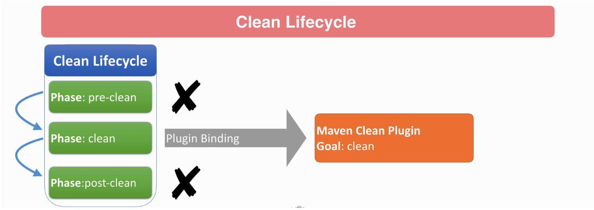

# Apache Maven: Beginner to Guru

- <https://www.udemy.com/course/apache-maven-beginner-to-guru/>

- [Maven-cheat-sheet.pdf](files/Maven-cheat-sheet.pdf)

## DevOps Notes

Notes by me while taking this course.

### First Maven Execution

Noticed that when running some maven tasks for the first time (like `clean` and `package`) it downloads artifacts and it takes a lot of time, and the next executions go really fast (no need to download stuff).

Doing this in a pipeline, where the runner is a "fresh" container, results in downloading artifacts allways.

There must be a way to prevent this.

---

The very first execution of `mvn package` for my simple Hello World project took 01:08 min, because maven needed to download a bunch of artifacts from `https://repo.maven.apache.org/`.

The next executions took less than 1 second!!!

That fact alerted me that probably I could dramatically improve the speed of my GitLab CI pipeline...

Every stage of the pipeline starts a "fresh" container. We have two stages with maven (one to build and another to run a SAST Scanner), I noticed that in both we're downloading artifacts...

I need to save such artifacts in a cache!

---


### Things I want to be able to clarify

- [ ] Why using `verify` to build the project
- [ ] Would it be possible to deploy to nexus via maven instead of curl?
- [ ] Understand the `settings.xml`.


## Compiling Java

### Creating Java jar files from Command line

- <https://www.udemy.com/course/apache-maven-beginner-to-guru/learn/lecture/12781593>

This "Hello World":

```java
public class HelloWorld {
  public  static void main(String[] args) {
    System.out.println("Hello World!");
  }
}
```

```sh
$ # the source is compiled with `javac`
$ javac HelloWorld.java 
$ # it creates the .class file
$ ls
HelloWorld.class  HelloWorld.java
$ # you can run that class with the `java` command:
$ java HelloWorld 
Hello World!
$ # let's build a .jar file with the `jar` command
$ jar cf myjar.jar HelloWorld.class 
$ # let's run the class HelloWorld from that .jar file
$ java -classpath myjar.jar HelloWorld 
Hello World!
```

**Note**: the `.jar` file is actually a zipped file.

In simple terms, what Maven basically does is compiling classes and then package them into a `.jar` file.


### Using 3rd Party Jars with Command Line Java

- <https://www.udemy.com/course/apache-maven-beginner-to-guru/learn/lecture/12781725>

**Note**: there's a `commons-lang3-3.8.1.jar` file in the zipped "Resources" of the lecture.

```sh
# building it
$ javac -classpath ./lib/* HelloWorld.java 

# running it
$ java -classpath ./lib/*:./ HelloWorld 
Hello World!
Hello world
```

Another thing maven does is managing such dependencies.


## Getting Started with Maven

In order to build with Maven we need a `pom.xml`.

Example for our HelloWorld:
```xml
<?xml version="1.0" encoding="UTF-8"?>
<project xmlns="http://maven.apache.org/POM/4.0.0" xmlns:xsi="http://www.w3.org/2001/XMLSchema-instance" xsi:schemaLocation="http://maven.apache.org/POM/4.0.0 http://maven.apache.org/xsd/maven-4.0.0.xsd">
    <modelVersion>4.0.0</modelVersion>

    <groupId>guru.springframework</groupId>
    <artifactId>hello-world</artifactId>
    <version>0.0.1-SNAPSHOT</version>

    <properties>
        <project.build.sourceEncoding>UTF-8</project.build.sourceEncoding>
        <project.reporting.outputEncoding>UTF-8</project.reporting.outputEncoding>
        <java.version>11</java.version>
        <maven.compiler.source>${java.version}</maven.compiler.source>
        <maven.compiler.target>${java.version}</maven.compiler.target>
    </properties>

</project>
```

Pay attention to that `<artifactId>` and `<version>`. They're goint to be used to generate the `.jar` file.

```sh
# clean out the environment (looks similar to `make clean`)
mvn clean

# create a jar file
mvn package

# inside the `target/` folder you'll see a file named
# `hello-world-0.0.1-SNAPSHOT.jar`

# if you run the `clean` again, the target/ directory will be deleted
mvn clean

# put your HelloWorld.java in a subdir
mkdir -p src/main/java
mv HelloWorld.java src/main/java

# you can clean and package in the same command line
mvn clean package

```


### Dependencies

In order to add dependencies to your project, just add the dependency's coordinates to your `pom.xml`, like this:

```xml
<dependencies>
    <dependency>
        <groupId>org.apache.commons</groupId>
        <artifactId>commons-lang3</artifactId>
        <version>3.8.1</version>
    </dependency>
</dependencies>
```

In the next run of `mvn package` it'll download the dependencies.


## Maven Basics

### Maven Coordinates

```xml
    <groupId>guru.springframework</groupId>
    <artifactId>hello-world</artifactId>
    <version>0.0.1-SNAPSHOT</version>
```

- `SNAPSHOT` sufix tells maven this is a development version.


### Maven Repositories

Types:

- Local: `~/.m2/`
- Central: <https://repo1.maven.org/maven2>
- Remote: other locations which can be public or private
    - JBoss, Oracle, Atlassian, Google Android
    - Private - hosted by companies for internal artifacts

```
                      ,-> Central
Project <-> ~/.m2/ <-{
                      '-> Others
```


### Maven Wagon

Maven Wagon is a unified Maven API working as a transport abstraction for artifact and repository handling code.

In some corporate environments you may need to configure Wagon for Proxy Settings.


### Maven POM

- Project Object Model
- XML document describing the Maven Project
- must comly with the maven-4.0.0.xsd
- POMs can inherit properties from a parent POM
- "Effective POM" - is the POM complete with inherited properties
    - `mvn help:effective-pom`


### Maven Dependencies

Dependency is an artifact which your Maven project depends upon. Typically a jar or pom.

Maven does dependency management.

Dependency Mediation: determines what version to use when multiple versions of the same dependency are encountered. Usually the latest wins.


Dependency Scope:

- Compile: default.
- Provided: provided by JDK or container at runtime.
- Runtime: not required for compile, but needed for runtime.
- Test: only available on test classpath, not transitive.
- System: similar to provided, but JAR is added to system explicitly (via file path).
- Import: imports dependency of POM.


Dependencies are managed by the Maven Dependency Plugin

Important Goals:

- `dependency:tree` - shows the dependency tree. Useful for resolving conflicts.
- `dependency:go-offline` - resolve all, prepare to go offline.
- `dependency:purge-local-repository` - clear artifacts from local repository.
- `dependency:sources` - get sources for all dependencies.

**Note about `mvn` syntax**: the notation `mvn dependency:tree` is like `mvn ${plugin}:${goal}`.


### Maven Standard Directory Layout

<https://maven.apache.org/guides/introduction/introduction-to-the-standard-directory-layout.html>

Basically: `src/main/java`.


### Maven Build Lifecycles

- Maven is based on the concept of build lifecycles
- A lifecycle is a pre-defined group of build steps called **phases**.
- Each phase can be bound to one or more plugin **goals**.
- Keep in mind all work done in Maven is done by plugins!
- Lifecycles and phases provide the framework to call plugin goals in a sequence.

- Pre-defined lifecycles: `clean`, `default`, `site`.
- `clean`:
    - does a clean of the project, removes all build artifacts from working directory
    - defined with plugin bindings
- `default`:
    - does the build and deployment of your project
    - defined without plugin bindings, bindings are defined for each packaging
- `site`:
    - creates a website for your project
    - least used in the enterprise
    - maven websites, for example, are built using Maven site lifecycle.


**Maven Clean Lifecycle**




**Default Lifecycle - High Level**

- Validate: verify project is correct
- Compile: compile source code
- Test: test compiled source code
- Package: package compiled files to packaging type
- Verify: run integration tests
- Install: install to local maven repository
- Deploy: deploy to shared maven repository


**Key concept**:

- Maven has 3 standard lifecycles: `clean`, `default`, `site`.
- Those lifecycles has multiple phases
- Some phases can be associated with goals via plugins.


### Maven Wrapper

- <https://www.udemy.com/course/apache-maven-beginner-to-guru/learn/lecture/12872844>

It's wrapper around maven which allows you to build your project via shell script on a machine without Maven installed.

```sh
mvn -N io.takari:maven:wrapper

# specify the maven version:
mvn -N io.takari:maven:wrapper -Dmaven=3.6.0
```

It creates a hidden folder called `.mvn/`.

**Note**: using a wrapper is considered a "best practice".


### Maven Archetypes

Maven Archetypes are project templates.

<http://maven.apache.org/archetype/index.html>


Example of use:
```sh
# from: http://maven.apache.org/archetypes/maven-archetype-simple/
mvn archetype:generate -DarchetypeGroupId=org.apache.maven.archetypes -DarchetypeArtifactId=maven-archetype-simple -DarchetypeVersion=1.4
```


## Common Maven Plugins

### Maven Lifecycle Plugin

#### Maven Clean Plugin

- Build Lifecycle - **clean**
- has only one goal: `clean`
- remote files generated by build process
- by default removes the `target/` directory and submodule root folders

#### Maven Compiler Plugin

- Build Lifecycle: **default**
- has two goals:
    - `compiler:compile`
    - `compiler:testCompile`
- by default uses compiler `javax.tools.JavaCompiler`
- default source and target language levels are Java 1.6
    - Apache team encourages theses values to be set


#### Maven Resources Plugin

- Build Lifecycle - **default**
- has 3 goals:
    - `resources:resources`
    - `resources:testResources`
    - `resources:copy-resources`
- purpose is to copy project resources to output directory


#### Mave Surefire Plugin

- Build Lifecycle - **default**
- has one goal: `surefire:test`
- the Surefire plugin is used to execute unit test of the project.
- By default supports JUnit 3/4/5 and TestNG
    - Cucumber runs under JUnit, Spock compiles to JUnit byte code
- By default includes classes named:
    - `**/Test*.java`
    - `**/*Test.java`
    - `**/*Tests.java`
    - `**/*TestCase.java`


#### Maven jar plugin

- Build Lifecycle - **default**
- has two goals:
    - `jar:jar`
    - `jar:test-jar`
- purpose is to build jars from compiled artifacts and project resources


#### Maven Deploy Plugin

- Build Lifecycle - **default**
- has two goals:
    - `deploy:deploy`
    - `deploy:deploy-file`
- Purpose is to deploy project artifacts to remote Maven repositories
- **Often done in CI**
    - it can be used to publish artifacts on Nexus!!!
- Configuration is typically part of the Maven POM


#### Maven Site Plugin

- Build Lifecycle - **site**
- has 7 goals:
    - `site:site`
    - `site:deploy`
    - `site:run`
    - `site:stage`
    - `site:stage-deploy`
    - `site:attach-descriptor`
    - `site:jar`
    - `site:effective-site`


