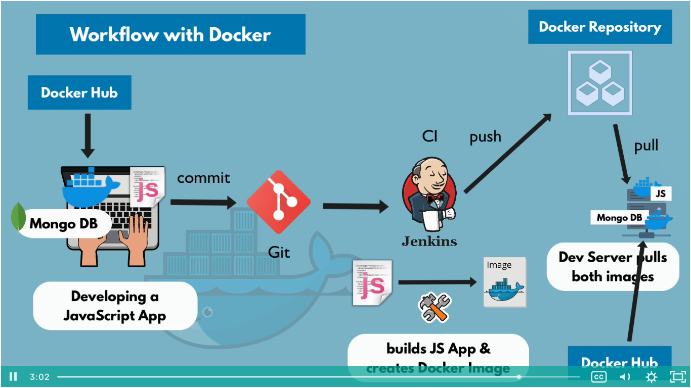

# Containers With Docker

## 1. What is a Container

- A way to package application with all the necessary dependencies and configuration
- portable artifact, easily shared and moved around
- make development and deployment more efficient

### Where do containers live?

- container repository
- public repository for Docker (Docker Hub)
- private repository


### How containers improved Application Development

#### Before containers

- Installation process of dev tools different on each OS environment
- Many steps where something could go wrong

#### After containers

- Own isolated environment
- Packaged with all needed configuration
- One command to install the app
- Run same app with more than one different version
- Devs and Ops work together to package the application in a container
- No environmental configuration needed on server - except Docker runtime

### Other Container Technologies

Docker is just the most popular container technology, but there are others, like:

- containerd
- cri-o
- etc.


## 2. Container vs. Image

### What is a container?

- Layers of images
    - advantage: equal layers are reused.
- Mostly Linux Base Image, because small in size
- Application image on top

### Docker Image

- the actual package
- artifact, that can be moved around

### Docker Container

- actually start the application
- it's an image running
- when it's started, the container environment is created

Analogy: OOP -> Image is the class, containers are the objects.


## 3. Docker vs. Virtual Machine

- OS have 2 layers above hardware:
    - 1. OS Kernel
    - 2. Applications

- Container images are much smaller
- Containers start and run much faster
- VM of any OS can run on any OS host

**My words:**

- Docker provides an OS Kernel to Applications.
- Virtual Machines provide hardware to Operating Systems.

## 4. Docker Architecture and Components

- Containers existed already before Docker
- Docker made containers popular

- Docker Engine:
    1. Server
    2. API
    3. CLI

- Docker Server:
    - container Runtime:
        - pulling images
        - managing container lifecycle
    - Volumes
        - persisting data
    - network
        - configuring network for container communication
    - build images
        - build own Docker images

### Alternatives for Docker

- Need only a container runtime?
    - containerd: <https://containerd.io/>
    - cri-o: <https://cri-o.io/>
- Need only an image builder:
    - buildah: <https://buildah.io/>

## 5. Main Docker Commands

```sh
# list locally available images
docker image ls

# list running containers
docker container ls
docker ps

# list all available containers
docker container ls -a
docker ps -a

# create and run a container based on an image
docker container run redis
docker container run redis:4.0  # specify the version

# create and run a container in detach mode
docker container run --detach redis
docker container run -d redis

# start an existing created container
docker container start container_name

# stop a running container
docker container stop container_name
```

### Container Port vs. Host Port

- multiple containers can run on your host machine
- your laptop has only certain ports available
- conflict when same port on host machine
- you can bind a different port between the container and your host ports

```sh
# host port: 6000
# container port: 6379
docker container run --publish 6000:6379 redis
docker container run -p 6000:6379 redis

# host port: 6001
# container port: 6379
docker container run --publish 6001:6379 redis:4.0
```


## 6. Debug Commands

```sh
# see the latest logs from a running container
docker container logs containerName

# execute a command in a running container
docker container exec containerName command

# start a shell session in a running container
docker container exec -it containerName /bin/bash
# using `env` to see the environment variables is quite useful
```

## 7. Docker Demo - Project Overview

Workflow with Docker




## 8. Developing with Docker

- <https://techworld-with-nana.teachable.com/courses/1108792/lectures/28662263>

```sh
# get project's source file from:
# https://gitlab.com/nanuchi/developing-with-docker
git clone git@gitlab.com:nanuchi/developing-with-docker.git

# get MongoDB image
docker pull mongo

# get MongoDB frontend
docker pull mongo-express

```

- 4:40 - Explaining Docker Network

```sh
# list available docker networks
docker network ls

# create a new network
docker network create mongo-network
```

### MongoDB containers

```sh
# https://hub.docker.com/_/mongo
# create a MongoDB container defining the root username/password
docker run \
  -p 27017:27017 \
  --detach \
  -e MONGO_INITDB_ROOT_USERNAME=admin \
  -e MONGO_INITDB_ROOT_PASSWORD=password \
  --name mongodb \
  --net mongo-network \
  mongo

# https://hub.docker.com/_/mongo-express
# create the Mongo Express container
docker run \
  -p 8081:8081 \
  --detach \
  -e ME_CONFIG_MONGODB_ADMINUSERNAME=admin \
  -e ME_CONFIG_MONGODB_ADMINPASSWORD=password \
  -e ME_CONFIG_MONGODB_SERVER=mongodb \
  --net mongo-network \
  --name mongo-express \
  mongo-express
```

- 14:30 - interacting with mongo-express interface


## 9. Docker Compose - Run multiple Docker containers

Comparison between `docker run` command and Docker compose yaml config:

**`docker run` commands:**
```sh
# mongodb
docker run \
  -p 27017:27017 \
  --detach \
  -e MONGO_INITDB_ROOT_USERNAME=admin \
  -e MONGO_INITDB_ROOT_PASSWORD=password \
  --name mongodb \
  --net mongo-network \
  mongo

# mongo-express
docker run \
  -p 8081:8081 \
  --detach \
  -e ME_CONFIG_MONGODB_ADMINUSERNAME=admin \
  -e ME_CONFIG_MONGODB_ADMINPASSWORD=password \
  -e ME_CONFIG_MONGODB_SERVER=mongodb \
  --net mongo-network \
  --name mongo-express \
  mongo-express
```

**`mongo.yaml`:**
```yaml
version: '3'
services:
  mongodb: # --name
    image: mongo
    ports: # --publish
      - 27017:27017
    environment: # -e
      - MONGO_INITDB_ROOT_USERNAME=admin
      - MONGO_INITDB_ROOT_PASSWORD=password

  mongo-express: # --name
    image: mongo-express
    ports: # --publish
      - 8081:8081
    environment:
      - ME_CONFIG_MONGODB_ADMINUSERNAME=admin
      - ME_CONFIG_MONGODB_ADMINPASSWORD=password
      - ME_CONFIG_MONGODB_SERVER=mongodb

# Docker Compose takes care of creating a common network!
```

Install docker-compose. See the version here: <https://github.com/docker/compose/releases>

```sh
sudo curl -L \
  https://github.com/docker/compose/releases/download/1.29.1/docker-compose-Linux-x86_64 \
  -o /usr/loca/bin/docker-compose
chmod +x /usr/local/bin/docker-compose
docker-compose --version
```

```sh
# booting up the containers specified in the `mongo.yml`:
docker-compose -f mongo.yml up

# turn down:
docker-compose -f mongo.yml down
```


## 10. Dockerfile - Build your own Docker Image

(see also [the notes "Building Images: The Dockerfile Basics"](../docker-mastery#building-images-the-dockerfile-basics))

Dockerfile is a blueprint for creating a Docker image.

```Dockerfile
FROM node:13-alpine

ENV \
    MONGO_DB_USERNAME=admin \
    MONGO_DB_PWD=password

# RUN command to be executed when creating the image
RUN mkdir -p /home/app

# COPY executes in the host machine
COPY . /home/app

# CMD is the entrypoint command
# command, arg1
CMD ["node", "/home/app/server.js"]
```

The filename MUST be exactly `Dockerfile` (including the capital `D`).

Assuming you're on the same directory of the `Dockerfile`:
```sh
docker image build -t my-app:1.0 .

# check if it really created the image:
docker image ls

```


## 11. Private Docker Repository

The full image name is `registryDomain/imageName:tag`. When the `registryDomain` is omitted, the default is Docker Hub.

Amazon ECR (Elastic Container Repository) is a service that provides private Docker repository.

```sh
# check which image you want to push to your repository
docker image ls

# docker login
# NOTE: AWS has a specific CLI command for it.
docker login ${registryDomain}

# tag the image
docker tag ${imageName}:${tag} ${registryDomain}/${imageName}:${tag}

# upload (push) the image
docker push ${registryDomain}/${imageName}:${tag}

# UPDATING AND PUSHING A NEW VERSION
####################################

# make the change you needed to do in the Dockerfile,
# and then build the new image:
docker image build -t my-app:1.1

# tag it
docker image tag my-app:1.1 ${registryDomain}/my-app:1.1

# push it
docker image push ${registryDomain}/my-app:1.1
```


## 12. Deploy docker application on a server

Docker compose yaml file:

```yaml
version: '3'
services:
  my-app:
    image: MY-PRIVATE-REGISTRY-DOMAIN/my-app:1.0
    ports:
      - 3000:3000
  mongodb:
    image: mongo
    ports:
      - 27017:27017
    environment:
      - MONGO_INITDB_ROOT_USERNAME=admin
      - MONGO_INITDB_ROOT_PASSWORD=password
    mongo-express:
      image: mongo-express
      ports:
        - 8080:8081
      environment:
        - ME_CONFIG_MONGODB_ADMINUSERNAME=admin
        - ME_CONFIG_MONGODB_ADMINPASSWORD=password
        - ME_CONFIG_MONGODB_SERVER=mongodb
```

And then
```sh
docker-compose -f docker-compose.yaml
```

## 13. Docker Volumes - Persisting Data

A directory in physical host file system is **mounted** into the virtual file system of Docker.

### 3 Volumes Types:

- Host Volume
    - you define the directory from the host system and the path where it'll be mounted in the container
    - e.g.: `docker container run -v /home/mount/data:/var/lib/mysql/data ...`

- Anonymous Volume
    - a persistent directory is automatically created by Docker and you define the path where it'll be mounted in the container
    - e.g.: `docker container run -v /var/lib/mysql/data`

- Named Volume
    - similar to the "Anonymous Volume" (the directory is automatically created by Docker), but you can reference it by name
    - e.g.: `docker container run -v name:/var/lib/mysql/data`
    - **THIS IS THE ONE YOU SHOULD BE USING IN PRODUCTION**

Example of Named Volume being used in a docker-compose file:
```yaml
version: '3'
services:
  mongodb:
    image: mongo
    ports:
      - 27017:27017
    volumes:
      - db-data:/var/lib/mysql/data

  mongo-express:
    image: mongo-express
    # ...

volumes:
  db-data # now you can reference this name in more than one container
```

## 14. Docker Volumes Demo

Using the project from this repo: <https://gitlab.com/nanuchi/developing-with-docker>

Check the `docker-compose.yaml` file. There's a `volumes:` there, and it's being used in `volumes:` of `mongodb`.

- Docker Volume Locations:
    - Windows: `C:\ProgramData\docker\volumes`
    - Linux/MacOS: `/var/lib/docker/volumes`

**MacOS Tip**: Docker in MacOS is actually a Linux virtual machine and then it's the host of the containers. Here's how to access the shell of such Linux virtual machine `screen ~/Library/Containers/com.docker.docker/Data/com.docker.driver.amd64-linux/tty`


## 15. Create Docker Hosted Repository on Nexus

- video: <https://techworld-with-nana.teachable.com/courses/1108792/lectures/28662266>

- In the Administration -> Repository -> Repositories, choose `docker-hosted`.
    - Set a port as an HTTP connector
    - reason: docker doesn't accept paths as repository (only `domain:port`)

- 08:00 - allowing insecure registries.


## 16. Deploy Nexus as Docker Container

```sh
# super user
sudo su

# install docker from snap
apt update
snap install docker

# create a docker volume for persistent data
docker volume create --name nexus-data

# check volumes
docker volume ls

# create and run the nexus container
docker container run \
  --detach \
  --publish 8081:8081 \
  --name nexus \
  --volume nexus-data:/nexus-data \
  sonatype/nexus3

# install net-tools for debugging
apt install net-tools

# check the open ports
netstat -lnpt


```

