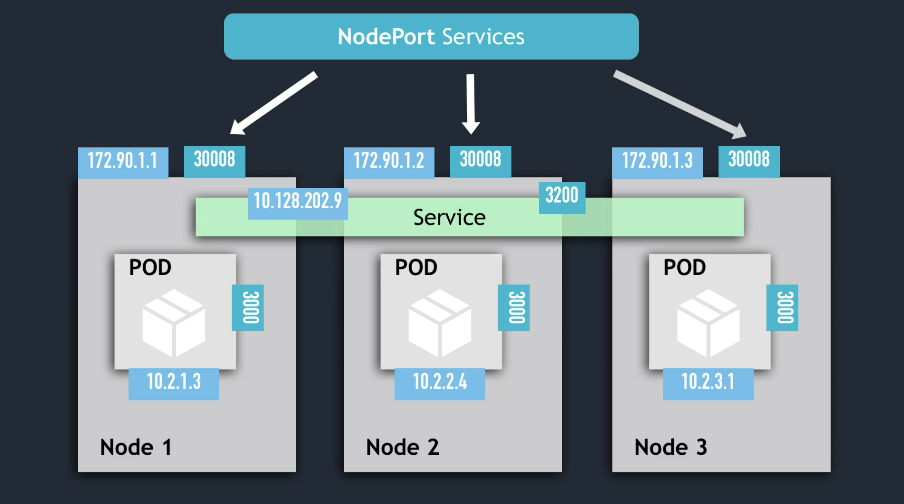
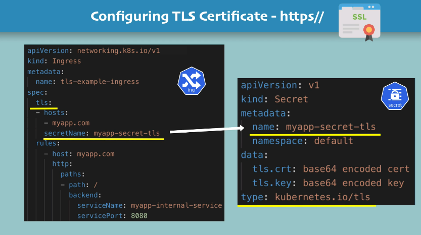

# Container Orchestration with Kubernetes

## 1. Intro to Kubernetes

- Open source **container orchestration tool**
- Developed by Google
- Helps you **manage containerized applications** in different **deployment environments**.

- Questions
    - What **problems** does kubernetes solve?
    - What are the **tasks** of an orchestration tool?

- The need for a container orchestration tool
    - Trend from **monolith** to **microservices**.
    - Increased usage of **containers**
    - Demand for a **proper way** of **managing** those hundreds of containers.

- What features do orchestration tools offer?
    - **high availability** or no downtime
    - **scalability** or hight performance
    - **disaster recovery** - backup and restore

Quote from Kelsey Hightower (found in "Cloud Native DevOps with Kubernetes" book):

> Kubernetes do the things that the very best system administrator would do: automation, failover, centralized logging, monitoring. It takes what we've learned in the DevOps community and makes it the default, out of the box.

## 2. Main Kubernetes Components

- video: <https://techworld-with-nana.teachable.com/courses/1108792/lectures/28679161>


### Node and Pod

- Node: a virtual machine where the pods run
- Pod:
    - smallest unit of k8s
    - abstraction layer over container
        - you only interact with the kubernetes layer
    - usually 1 application per pod
    - each pod gets its own IP address
    - new IP address on re-creation
        - inconvenient


### Service and Ingress

- Service:
    - permanent IP address
    - connected to the Pod, but...
    - lifecycle of Pod and Service are NOT connected
        - if a Pod dies, the Service keeps the IP address
    - types:
        - internal services
        - external services
            - should use HTTPS (securre)
            - should have a friendly name (`my-app.com`)
            - managed by **Ingress**
    - service is also a load balancer, so it can forward requests to several nodes


### ConfigMap and Secrets

- ConfigMap:
    - external configuration of your application
        - allows you to configure your app with no need to rebuild it.
        - !!! **don't put credentials into ConfigMap** !!!

- Secret:
    - used to store secret data (e.g.: credentials)
    - base64 encoded
        - true encryption can only be achieved via 3rd party tools
    - !(?) the buil-in security mechanism is not enabled by default!
    - (?) use it as environment variables or as a properties file


### Volumes

- storage can be be:
    - on local machine
    - or remote, outside the k8s cluster
- regardless of storage being local or remote, always consider as an external component of k8s
    - !!! **k8s doesn't manage data persistance!**


### Deployment and StatefulSet

- Deployment:
    - blueprint for `my-app` pods
    - you create Deployments
    - abstraction layer over pods
        - in practice you mostly work with deployments and not with pods
    - !!! **DB can't be replicated via Deployment**
    - for stateless apps

- Statefulset
    - meant for application like Databases
    - for STATEFUL apps
    - :( deploying StatefulSet is not easy
    - DB are often hosted outside of k8s cluster


## 3. Kubernetes Architecture

- Types of clusters:
    - Master
    - Slave

- Each Node has multiple Pods on it
- Worker Nodes do the actual work
- 3 processes must be running on every Node
    1. container runtime
    2. kubelet:
        - interacts with Container and Node
        - starts the Pod with a Container inside
    3. kube proxy - forwards the requests


### Master Nodes

- 4 processes on every master node
    1. API server
        - the cluster gateway
    2. Scheduler
        - **note**: Scheduler just decids **on which Node** nwe pod should be scheduled
        - the process who actually starts the scheduling in the Node's kubelet
    3. Controller Manager:
        - detects cluster state changes
    4. etcd
        - consider it as "the cluster's brain"
        - key value store
        - examples of info in etcd:
            - is the cluster healthy?
            - what resources are available?
            - did the cluster state change?
        - **note**: app data is NOT stored in etcd


### Example Cluster Set-Up

A very small cluster you're probably have

- 2 master nodes
- 3 worker nodes

To add new Master/Worker server

1. get new bare server
2. install all the master/worker node processes
3. add it to the cluster


## 4. Minikube and kubectl - Local Kubernetes Cluster

### Minikube

Having a real cluster setup to practice would require a lot of resources, not usually available in personal computers.

Minikube is a way to test local cluster setup. You have Master and Worker Nodes processes running on **ONE machine**.

- minikube:
    - creates a virtual box on your computer
    - Node runs in that virtual box
    - 1 node k8s cluster
    - for testing purposes


### kubectl

`kubectl` is a command line tool for k8s cluster.

One of the master processes mentioned earlier is the `API Server`. Clients communicate with the `API Server` through a web UI, API calls, or a CLI. And `kubectl` is that CLI (and the most powerful one).


### Installing & Creating a minikube cluster

- video: <https://techworld-with-nana.teachable.com/courses/1108792/lectures/28679481>

- installation instructions
    - minikube: <https://kubernetes.io/docs/tasks/tools/install-minikube/>
    - kubectl: <https://kubernetes.io/docs/tasks/tools/install-kubectl/>

```sh
# define the virtual machine driver with `--driver`
# default is 'autodetect'
minikube start --driver=hyperkit

# check minikube status
minikube status

# check the kubectl version
kubectl version
```

- **kubectl CLI**: for configuring the minikube cluster.
- **minikube CLI**: for start up/deleting the cluster.


## 5. Main kubectl commands

### Get status of components

```sh
kubectl get nodes

kubectl get pod

kubectl get services
```

### Creating a Pod (actually a deployment)

Pod is the smallest unit of a cluster, **but** we're not going to create pods directly. As mentioned earlier, "Deployment" is an abstraction layer over Pods. And with `kubectl` we're going to create "Deployments".

```sh
# get help about ~~pod~~ deployment creation
kubectl create -h

# usage:
# kubectl create deployment NAME --image=image [--dry-run] [options]
# example creating an nginx deployment (nginx image will
# be donwloaded from Docker Hub):
$ kubectl create deployment nginx-depl --image=nginx
deployment.apps/nginx-depl created

# get deployment status
$ kubectl get deployment
NAME         READY   UP-TO-DATE   AVAILABLE   AGE
nginx-depl   0/1     1            0           9s

# get pod status
$ kubectl get pod
NAME                          READY   STATUS              RESTARTS   AGE
nginx-depl-5c8bf76b5b-nq8dj   0/1     ContainerCreating   0          17s
# STATUS above is still 'ContainerCreating'...
# after a couple of minutes, it's 'Running'
$ kubectl get pod
NAME                          READY   STATUS    RESTARTS   AGE
nginx-depl-5c8bf76b5b-nq8dj   1/1     Running   0          2m12s

# get replicaset status
# note: replicaset is managing the replicas of a pod
# note 2: the pod name is
# ${DEPLOYMENT_NAME}-${REPLICASET_HASH}-${POD_HASH}
$ kubectl get replicaset
NAME                    DESIRED   CURRENT   READY   AGE
nginx-depl-5c8bf76b5b   1         1         1       2m3s
```


### Layers of Abstraction


**Everything below "Deployment" is handled by Kubernetes**


### Editing a Pod / Deployment

When you edit a deployment, kubernetes automatically create a new pod, and once it's up and running it kills the old pod.

```sh
# edit the deployment
# change spec.template.spec.containers.image from 'nginx' to 'nginx:1.16'
$ kubectl edit deployment nginx-depl
deployment.apps/nginx-depl edited

# checking the deployment status after edition
$ kubectl get deployment
NAME         READY   UP-TO-DATE   AVAILABLE   AGE
nginx-depl   1/1     1            1           20m

# checking pods status
# here, the old version is running and the new one is being created
$ kubectl get pod
NAME                          READY   STATUS              RESTARTS   AGE
nginx-depl-5c8bf76b5b-nq8dj   1/1     Running             0          20m
nginx-depl-7fc44fc5d4-fbtt5   0/1     ContainerCreating   0          9s

# new pod is running, old one is terminating
$ kubectl get pod
NAME                          READY   STATUS        RESTARTS   AGE
nginx-depl-5c8bf76b5b-nq8dj   0/1     Terminating   0          21m
nginx-depl-7fc44fc5d4-fbtt5   1/1     Running       0          30s

# only the new pod is running
$ kubectl get pod
NAME                          READY   STATUS    RESTARTS   AGE
nginx-depl-7fc44fc5d4-fbtt5   1/1     Running   0          37s

# the old replicaset has no pods
$ kubectl get replicaset
NAME                    DESIRED   CURRENT   READY   AGE
nginx-depl-5c8bf76b5b   0         0         0       42m
nginx-depl-7fc44fc5d4   1         1         1       21m
```


### Debugging pods

- `kubectl get pod --watch`
- `kubectl logs ${POD_NAME}`
- `kubectl describe pod ${POD_NAME}`

```sh
# let's create another deployment with a mongodb image
# (which creates a more verbose log)
kubectl create deployment mongo-depl --image=mongo

# the pod is not running yet
$ kubectl logs mongo-depl-5fd6b7d4b4-rpqhg
Error from server (BadRequest): container "mongo" in pod "mongo-depl-5fd6b7d4b4-rpqhg" is waiting to start: ContainerCreating     

# checking the detailed status
$ kubectl describe pod mongo-depl-5fd6b7d4b4-rpqhg
Name:           mongo-depl-5fd6b7d4b4-rpqhg
Namespace:      default
Priority:       0
Node:           minikube/192.168.99.100
Start Time:     Thu, 10 Jun 2021 10:24:08 -0300
Labels:         app=mongo-depl
                pod-template-hash=5fd6b7d4b4
# ...
# more info
# ...
Events:
Type    Reason     Age   From               Message
----    ------     ----  ----               -------
  Normal  Scheduled  4m6s  default-scheduler  Successfully assigned default/mongo-depl-5fd6b7d4b4-rpqhg to minikube
  Normal  Pulling    4m5s  kubelet            Pulling image "mongo"
  Normal  Pulled     106s  kubelet            Successfully pulled image "mongo" in 2m18.898375616s
  Normal  Created    105s  kubelet            Created container mongo
  Normal  Started    105s  kubelet            Started container mongo

# the pod is now up and running, let's check the logs
$ kubectl logs mongo-depl-5fd6b7d4b4-rpqhg
# ... a lot of mongodb logs...
```

- Starting an interactive shell session inside the pod:
```sh
kubectl exec -it ${POD_NAME} -- /bin/bash
```

- getting the current status of a deployment:
```sh
kubectl get deployment nginx-deployment -o yaml > nginx-deployment-result.yaml
```

### Delete Deployment

```sh
# deleting the mongodb deployment
$ kubectl delete deployment mongo-depl
deployment.apps "mongo-depl" deleted

# after deleting a deployment, its pods are going to terminate
$ kubectl get pods
NAME                          READY   STATUS        RESTARTS   AGE
mongo-depl-5fd6b7d4b4-rpqhg   0/1     Terminating   0          18m
nginx-depl-7fc44fc5d4-fbtt5   1/1     Running       0          71m

# the replicaset is already gone
$ kubectl get replicaset
NAME                    DESIRED   CURRENT   READY   AGE
nginx-depl-5c8bf76b5b   0         0         0       92m
nginx-depl-7fc44fc5d4   1         1         1       71m

# deleting the nginx deployment too
$ kubectl delete deployment nginx-depl
deployment.apps "nginx-depl" deleted

$ kubectl get pods
NAME                          READY   STATUS        RESTARTS   AGE
nginx-depl-7fc44fc5d4-fbtt5   0/1     Terminating   0          72m

$ kubectl get replicaset
No resources found in default namespace.
```

### Apply Configuration File

`kubectl apply -f config-file.yaml`

An example for `nginx-deployment.yaml`:
```yaml
apiVersion: apps/v1
kind: Deployment
metadata:
  name: nginx-deployment
  labels:
    app: nginx
spec:       # deployment specs
  replicas: 1
  selector:
    matchLabels:
      app: nginx
  template:
    metadata:
      labels:
        app: nginx
    spec:   # pod specs
      containers:
      - name: nginx
        image: nginx:1.16
        ports:
        - containerPort: 80
```

```sh
# type the file above
$ vim nginx-deployment.yaml

# applying that config file
# note that the output says "... created"
$ kubectl apply -f nginx-deployment.yaml 
deployment.apps/nginx-deployment created

$ kubectl get pod
NAME                                READY   STATUS    RESTARTS   AGE
nginx-deployment-644599b9c9-qp8lb   1/1     Running   0          7s

$ kubectl get deployment
NAME               READY   UP-TO-DATE   AVAILABLE   AGE
nginx-deployment   1/1     1            1           17s

$ kubectl get replicaset
NAME                          DESIRED   CURRENT   READY   AGE
nginx-deployment-644599b9c9   1         1         1       28s

# edit the file and increase the `spec.replicas` from 1 to 2
$ vim nginx-deployment.yaml 

# note that the output says "... configured"
# kubernetes know when to create/update a deployment
$ kubectl apply -f nginx-deployment.yaml 
deployment.apps/nginx-deployment configured

$ kubectl get deployment
NAME               READY   UP-TO-DATE   AVAILABLE   AGE
nginx-deployment   2/2     2            2           65s

$ kubectl get replicaset
NAME                          DESIRED   CURRENT   READY   AGE
nginx-deployment-644599b9c9   2         2         2       68s

$ kubectl get pods
NAME                                READY   STATUS    RESTARTS   AGE
nginx-deployment-644599b9c9-c9nc2   1/1     Running   0          16s
nginx-deployment-644599b9c9-qp8lb   1/1     Running   0          76s
```

### Summarizing

```sh
# CRUD commands
########################################
kubectl create deployment ${NAME}
kubectl edit deployment ${NAME}
kubectl delete deployment ${NAME}
# using files
kubectl apply -f ${YAML_FILE}
kubectl delete -f ${YAML_FILE}

# Status of different k8s components
########################################
kubectl get nodes | services | deployment | replicaset | pod

# Debugging
########################################

# get logs
kubectl logs ${POD_NAME}

# detailed info about the pod
kubectl describe pod ${POD_NAME}

# interactive shell session inside a pod
kubectl exec -it ${POD_NAME} -- /bin/bash
```


## 6. YAML Configuration File

### 3 Parts of a k8s Configuration File

1. metadata
2. specifications
    - the first two lines (`apiVersion` and `kind`)
    - and the `spec` part
    - attributes of `spec` are specific to the `kind`.
3. status
    - automatically generated/added by kubernetes
    - created by comparing the desired state (from the `spec` part of the yaml) and the actual state
    - if the states don't match, kubernetes knows that there's something to be fixed
    - status data comes from `etcd` Master process
        - `etcd` holds the current status of any k8s component


### Format of k8s Configuration File

- YAML file
- "human friendly data serialization standard for all programming languages
- syntax: strict indentation
- store the config file with your code or own git repository


### Blueprint for Pods (Templates)

The `template`:

- has its own `metadata` and `spec` sections (it's like a config file inside a config file).
- applies to a Pod
- it's the blueprint for a Pod


### Connecting components (Labels & Selectors & Ports)

Connection is stablished using labels and selectors.

- `metadata` part contains the `labels`
- `spec` part contains `selector`

- Pods get the label through the template blueprint
    - example:
```yaml
spec:
  template:
    metadata:
    labels:
        app: nginx
```

- we tell the Deployment to create the connection only for the pods where labels match with the one defined in `selector`
```yaml
spec:
  selector:
    matchLabels:
      app: nginx
```

- this way the Deployment knows which Pod belongs to it.

- deployment has it's own label, used by the `Service`.

- the `selector` in the `Service` yaml file identifies to which Deployment it's connected to.

**Ports**


```sh
# creating deployment and service
kubectl apply -f nginx-deployment.yaml
kubectl apply -f nginx-service.yaml

# let's check them
kubectl get pod
kubectl get service

# get more details about the service
kubectl describe service nginx-service
# check the Selector, TargetPort and Endpoints

# you can get more pod information with -o wide
kubectl get pod -o wide

# the automatically generated status
kubectl get deployment nginx-deployment -o yaml

# save it in a file and compare with the original one
# the `status` part of the file can help with debugging
kubectl get deployment nginx-deployment -o yaml > nginx-deployment-result.yaml
```


## 7. Complete Demo Project - Deploying Application in Kubernetes Cluster

### Overview


### Request Flow

browser -> Mongo Express External Service -> Mongo Express Pod -> MongoDB Internal Service -> MongoDB Pod


### 1st step - MongoDB Deployment

`mongo.yaml`
```yaml
apiVersion: apps/v1
kind: Deployment
metadata:
  name: mongodb-deployment
  labels:
    app: mongodb
spec:
  replicas: 1
  selector:
    matchLabels:
      app: mongodb
  template:
    metadata:
      labels:
        app: mongodb
    spec:
      containers:
      - name: mongodb
        image: mongo
        ports:
        - containerPort: 27017
        env:
        - name: MONGO_INITIDB_ROOT_USERNAME
          valueFrom: # remember to create the Secret before creating the Deployment
            secretKeyRef:
              name: mongodb-secret
              key: mongo-root-username
        - name: MONGO_INITIDB_ROOT_PASSWORD
          valueFrom: # remember to create the Secret before creating the Deployment
            secretKeyRef:
              name: mongodb-secret
              key: mongo-root-password
```

### 2nd step - Create the Secret

`mongo-secret.yaml`
```yaml
apiVersion: v1
kind: Secret
metadata:
  name: mongodb-secret
type: Opaque
data:
  mongo-root-username: # paste here the output of `echo -n username | base64`
  mongo-root-password: # paste here the output of `echo -n password | base64`
```

**Note**: the Secret file must be created before the Deployment.
```sh
# creating the Secret
kubectl apply -f mongo-secret.yaml

# check if it was actually created:
kubectl get secret

# now let's create the Deployment
kubectl apply -f mongo.yaml

# get setup info
kubectl get all
```

### 3rd step - Create a Service

Let's create a service so other pods can access the MongoDB.

Deployment and Service usually belong together, so let's put their configs in the same file. In order to achieve that you just need to separate the configs with `---` in a line.

`mongo.yaml`
```yaml
# ...
# Deployment configs
# ...
---
apiVersion: v1
kind: Service
metadata:
  name: mongodb-service
spec:
  selector:
    app: mongodb
  ports:
    - protocol: TCP
      port: 27017
      targetPort: 27017
```

Creating the Service:

```sh
# this will keep mongodb-deployment unchanged and create mongodb-service
kubectl apply -f mongo.yaml

# check the service status
kubectl get service

# check if the service is connected to the right pod
kubectl describe service mongodb-service
# check the 'Endpoints' IP:port address

# compare with the pod's IP
kubectl get pod -o wide

# check them all
kubectl get all
kubectl get all | grep mongodb
```


### 4th step - Create Mongo Express Deployment and ConfigMap

`mongo-express.yaml`
```yaml
apiVersion: app/v1
kind: Deployment
metadata:
  name: mongo-express
  labels:
    app: mongo-express
spec:
  replicas: 1
  selector:
    matchLabels:
      app: mongo-express
  template:
    metadata:
      labels:
        app: mongo-express
    spec:
      containers:
      - name: mongo-express
        image: mongo-express
        ports:
        - containerPort: 8081
        env: # 3 variables needed by mongo-express to connect to mongodb
        - name: ME_CONFIG_MONGODB_ADMINUSERNAME
          valueFrom:
            secretKeyRef:
              name: mongodb-secret
              key: mongo-root-username
        - name: ME_CONFIG_MONGODB_ADMINPASSWORD
          valueFrom:
            secretKeyRef:
              name: mongodb-secret
              key: mongo-root-password
        - name: ME_CONFIG_MONGODB_SERVER
          valueFrom:
            configMapKeyRef:
              name: mongodb-configmap
              key: database_url
```

Database URL goes in the ConfigMap:

`mongo-configmap.yaml`
```yaml
apiVersion: v1
kind: ConfigMap
metadata:
  name: mongodb-configmap
data:
  database_url: mongodb-service
```

ConfigMap must already be in the k8s cluster when referencing it.

```sh
# first the configmap...
kubectl apply -f mongo-configmap.yaml

# ... and then the deployment referencing the configmap
kubectl apply -f mongo-express.yaml

# check the pod
kubectl get pod

# check the logs
kubectl logs ${POD_NAME}
```

### 5th step - Create an External Service

We need an external service to allow browsers to access Mongo Express.

Again, let's keep the Service configs in the same file as the Deployment.

`mongo-express.yaml`:
```yaml
# ... Mongo Express Deployment configs
---
apiVersion: v1
kind: Service
metadata:
  name: mongo-express-service
spec:
  selector:
    app: mongo-express

  # The 'type: LoadBalancer' is what make it an External Service.
  # It assigns an external IP address to this Service, making it
  # accept external requests.
  type: LoadBalancer


  ports:
    - protocol: TCP
      port: 8081
      targetPort: 8081
      # with 'nodeport:' you define the external listening port
      nodePort: 30000
```

Create the service:
```sh
kubectl apply -f mongo-express.yaml

# check the services
kubectl get service

# note in the output above that the TYPE means
# - LoadBalancer: external service
# - ClusterIP: internal service (default)

```

Specific to a minikube setup:
```sh
# assign a public IP address to a service
minikube service mongo-express-service
```


## 8. Namespaces - Organizing Components

### What is a Namespace?

- a way to organize resources 
- it's like a virtual cluster inside a cluster

- 4 Namespaces are created by default:
    1. `kube-system`
      - not for your use
    2. `kube-public`
      - publicly accessible data
      - a ConfigMap which contains cluster information
      - access that info using `kubectl cluster-info`
    3. `kube-node-lease`
      - heartbeats of nodes
      - each node has associated lease object in namespace
      - determines the availability of a node
    4. `default`
      - resources you create are located here

### Create a Namespace

Command line:
```sh
kubectl create namespace my-namespace

# see it in your list of namespaces
kubectl get namespaces
```

You can also create a namespace using a configuration file.


### Why use Namespaces?

1. Resources grouped in Namespaces
2. Conflicts: Many teams, same application
3. Resource sharing:
    - staging and Development
    - Blue/Green Deployment
4. Access and Resource Limits on Namespaces


### Characteristics of Namespaces

- You can't access most resources from another Namespace
    - example: each namespace must define its own ConfigMap
- You can access a Service in another Namespace
- Some components can't be created within a Namespace
    - they live globally in a cluster
    - you can't isolate them
    - examples: volume and node
    - `kubectl api-resources --namespaced=false`
    - `kubectl api-resources --namespaced=true`


### Create Components in Namespaces

Assuming you already created a namespace with `kubectl create namespace my-namespace`.

If no Namespace is provided, the component is created in the `default` Namespace. You can check it with `kubectl get ${COMPONENT_KIND} -o yaml` and checking the `metadata.namespace`.

One way is to provide the namespace in the command line:
```sh
# assuming the file doesn't have a namespace
kubectl apply -f mysql-configmap.yaml --namespace=my-namespace
```

Another way is just to put it in the yaml file:
```yaml
metadata:
  # ...
  namespace: my-namespace
```


### Change Active Namespace

Change the active namespaces with `kubens`. You have to install the tool: <https://github.com/ahmetb/kubectx>.


## 9. Services - Connecting to Applications Inside Cluster

- video: <https://techworld-with-nana.teachable.com/courses/1108792/lectures/28706433>

### What is a Service and why do we need it?

"The Service component is an abstraction layer that basically represents an IP address"

- Each Pod has its own IP address
    - Pods are ephemeral - destroyed frequently
- Service:
    - has a stable IP address
    - does load balancing
    - loose coupling
    - able to communicate within & outside the cluster
- 4 (or 3) types of Services:
    - `ClusterIP` (default)
    - `Headless` (actually a subtype of `ClusterIP`)
    - `NodePort`
    - `LoadBalancer`


### ClusterIP Services    

- aka Internal Service
- default type

- How the Service knows to which Pod it needs to forward the request to?
    - Pods are identified via `selector`s
    - key value pairs
    - `labels` of pods
    - you can give any name you want


- If a Pod has several ports open, how the service knows to which port to forward the request to?
    - `targetPort` Service attribute

**Service Endpoints**

Kubernetes creates `Endpoint` objects. They have the same name as the Service and keep track of which Pods are the members/endpoints of the Service.

```sh
kubectl get endpoints
```

**Service Communication: `port` vs `targetPort`**

- The service `port` is arbitrary (choose anything you want)
- The `targetPort` must match the port the Pod is listening at.

**Multi-Port Services**


### Headless Services

13min

- It's a way to allow pods to be accessed directly.
- Useful for pods running stateful applications (like databases)
- Apparently it's a subtype of the `ClusterIP` service.

It's declared like this:
```yaml
# ...
kind: Service
# ...
spec:
  clusterIP: None
# ...
```

And you can see it in the output of `kubectl get services`, in the line where the column `CLUSTER-IP` says `None`.


### NodePort Services
 
17:35

- creates a service that is accessible on a static port on each worker node in the cluster
- a `NodePort` service is able to receive connections from outside the cluster
- `nodePort` attribute must be between 30000 - 32767
- when you create a `NodePort` service, a `ClusterIP` service is automatically created
- **NOT SECURE!!** It exposes the Nodes to the "external world"

- **??? DOUBT ???:**
    - what's the difference between `NodePort` and `LoadBalancer`?
    - what's the usecase for `NodePort`?




### LoadBalancer Services

- `LoadBalancer` makes the Service become accessible externally.
- automatically creates a `NodePort` and a `ClusterIP` services.
- it's an extension of `NodePort` (and `NodePort` is an extension of `ClusterIP`).


### Wrap-Up

- `NodePort` service is **NOT** for external connection.
- configure Ingress or LoadBalancer for production environments


## 10. Ingress - Connecting to Applications Outside Cluster

- video: <https://techworld-with-nana.teachable.com/courses/1108792/lectures/28706439>

- Ingress allows the application to have a simple and secure endpoint, like `https://my-app.com/`.
- Ingress needs an **implementation**, which is called **Ingress Controller**.

Installing Ingress Controller in minikube:
```sh
# automatically starts k8s nginx implementation of Ingress Controller
minikube addons enable ingress

# check if it's running fine:
kubectl get pod -n kube-system
```

### kubernetes-dashboard

**UPDATE**: apparently the example below doesn't work anymore. The kubernetes-dashboard can be accessed via `minikube dashboard` (which is not really a good Ingress config exercise).

- In minikube cluster kubernetes-dashboard already exists out-of-the-box, but not accessible externally. Let's configure it to be accessible.
```sh
# check if it's running
kubectl get all -n kubernetes-dashboard
```

create `dashboard-ingress.yaml`:
```yaml
apiVersion: networking.k8s.io/v1
kind: Ingress
metadata:
  name: dashboard-ingress
  namespace: kubernetes-dashboard
spec:
  rules:
  - host: dashboard.com
    http:
      paths:
      - backend:
        serviceName: kubernetes-dashboard
        servicePort: 80
```

back to terminal:
```sh
kubectl apply -f dashboard-ingress.yaml

# check if it's running
kubectl get ingress -n kubernetes-dashboard

# if the ADDRESS is not visible yet, use the --watch option
kubectl get ingress -n kubernetes-dashboard --watch

# get the ADDRESS and edit your /etc/hosts
echo "${IP_ADDRESS}  dashboard.com" | sudo tee /etc/hosts

# open "http://dashboard.com/" in your browser
```

### Multiple paths for the same host

- video: <https://techworld-with-nana.teachable.com/courses/1108792/lectures/28706439> - 18:25

```yaml
apiVersion: networking;k8s.io/v1
kind: Ingress
metadata:
  name: simple-fanout-example
  annotations:
    nginx.ingress.kubernetes.io/rewrite-target: /
spec:
  rules:
  - host: myapp.com
    http:
      paths:
      - path: /analytics
        backend:
          serviceName: analytics-service
          servicePort: 3000
      - path: /shopping
        backend:
          serviceName: shopping-service
          servicePort: 8080
```
 
### Multiple sub-domains or domains

- video: <https://techworld-with-nana.teachable.com/courses/1108792/lectures/28706439> - 19:45

Multiple hosts with 1 path. Each host represents a subdomain.
```yaml
apiVersion: networking.k8s.io/v1
kind: Ingress
metadata:
  name: name-virtual-host-ingress
spec:
  rules:
  - host: analytics.myapp.com
    http:
      paths:
        backend:
          serviceName: analytics-service
          servicePort: 3000
  - host: shopping.myapp.com
    http:
      paths:
        backend:
          serviceName: shopping-service
          servicePort: 8080
```


### Configuring TLS Certificate

- video: <https://techworld-with-nana.teachable.com/courses/1108792/lectures/28706439> - 20:45

You only need this in your ingress yaml file:
```yaml
# ...
spec:
  tls:
  - hosts:
    - myapp.com
    secretName: myapp-secret-tls
    # and, of course, have a Secret with
    # that name in the same namespace
```



**NOTES**:

1. data keys need to be `tls.crt` and `tls.key`
2. values of those keys are **actual file contents**, not file paths
3. Secret component must be in the same namespace as the Ingress component


## 11. Volumes - Persisting Application Data

3 k8s components for storage:

- persistent volume
- persistent volume claim
- storage class


### The Need of Volumes

- kubernetes doesn't provide data persistence out-of-the-box, you need to configure it

Requirements:

1. storage must not depend on the pod lifecycle (because pods are ephemeral)
2. storage must be available on all nodes
3. storage needs to survive even if cluster crashes


### Persistent Volume

- created via yaml:
    - `kind: PersistentVolume`
- needs actual physical storage
    - tricky part:
        - Where does this storage come from and who makes it available to the cluster?
        - What type of storage do you need?
        - The storage management is out of kubernetes' scope. It must be done outside the cluster, and the `PersistentVolume` component is just an interface to the actual storage.
        - You can think of storage as an external plugin to your cluster.
- Persistent Volumes are NOT namespaced

### Local vs. Remote Volume Types
 
Local volume types violate requirements 2 and 3 for data persistence:

- tied to one specific node
- not surviving a cluster crash

**Not used for DataBase persistence.** Use remote storage instead.

### Who Creates Persistent Volumes

There are two roles:

- k8s admin
- k8s user

Storage resource is provisioned by the admin. And the user makes their application claim the Persistent Volume.

Persistent Volume Claim is also a component `kind: PsersistentVolumeClaim`.

Summing up:

1. admins configure storage
2. admins create Persistent Volumes
3. users claim Persistent Volumes through `PersistentVolumeClaim`


### Level of Volume Abstractions

- Pod requests the volume through `PersistentVolumeClaim`
- Claim tries to find a volume in the cluster (note: claims must be in the same namespace as the pod)
- Volume has the actual storage backend info


### ConfigMap and Secret

ConfigMap and Secret are local volumes, managed by kubernetes. They can be mounted into your pod/container.


### Storage Class

StorageClass provisions Persistent Volumes dynamically, when `PersistentVolumeClaim` claims it.

- Another abstraction level, abstracting:
    - underlying storage provider
    - parameters for that storage

- Storage Class is also a kubernetes component, created via yaml file:
    - `kind: StorageClass`
    - backend defined via `provisioner` attribute

**Usage**:

1. pod claims via PVC
2. PVC requests storage from StorageClass
3. StorageClass creates a PersistentVolume that meets the needs of the claim (using the defined provisioner)
