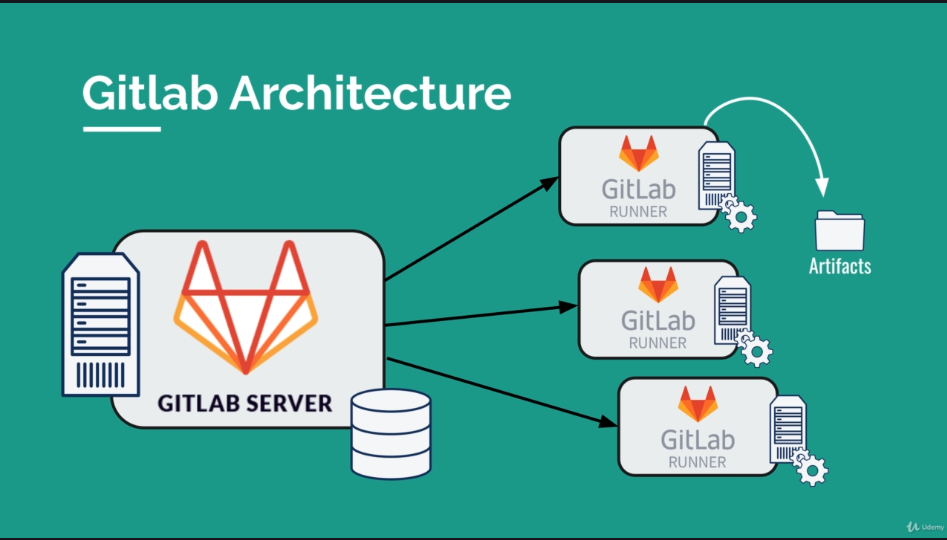
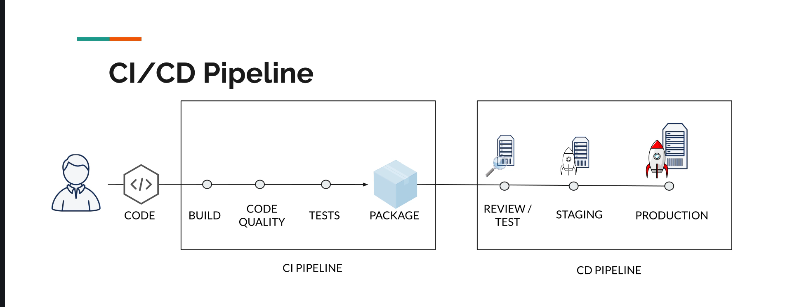

# GitLab CI: Pipelines, CI/CD and DevOps for Beginners

- link: <https://www.udemy.com/course/gitlab-ci-pipelines-ci-cd-and-devops-for-beginners>

## Introduction

Create a repo and then add a `.gitlab-ci.yml` file like this:
```yml
# define the order of execution
stages:
    - prep
    - build
    - test

# list of jobs
prepare the car:
    # defining which stage this job belongs to
    stage: prep
    script:
        - mkdir build
        - touch build/car.txt
    # artifacts are kept for the next job
    artifacts:
        paths:
            - build/

author:
    stage: build
    script:
        - mkdir meta
        - echo "$GITLAB_USER_NAME" > meta/author
    artifacts:
        paths:
            - meta/

build the car:
    # multiple jobs with the same stage run in parallel
    stage: build
    script:
        - cd build
        - echo "chassis" > car.txt
        - echo "engine" >> car.txt
        - echo "wheels" >> car.txt
    artifacts:
        paths:
            - build/

test the car:
    stage: test
    script:
        - ls
        - test -f build/car.txt
        - cd build
        - cat car.txt
        - grep "chassis" car.txt
        - grep "engine" car.txt
        - grep "wheels" car.txt
        - cat ../meta/author

```

**Notes**:
- the filename **must** be `.gitlab-ci.yml`.
- the file **must** be in the root dir of the project.
- the Auto DevOps is NOT enabled (not sure what it means).


### gitlab architecture



Configuring Runners:
- settings > CI/CD > Runners > Expand


## Exercise with Gatsby

```sh
npm install -g gatsby-cli
gatsby new static-website
cd static-website
gatsby develop
# create a repository in gitlab called my-static-website
git remote add origin git@gitlab.com:USERNAME/my-static-website.git
git push -u origin master
# check the gitlab repo

# building locally
gatsby build
# the output of this process is placed in the public dir
ls public
```

Create a `.gitlab-ci.yml`:
```yml
image: node

stages:
  - build
  - test
  - deploy

build website:
  stage: build
  script:
    - npm install
    - npm install -g gatsby-cli
    - gatsby build
  artifacts:
    paths:
      - ./public

test artifact:
  image: alpine
  stage: test
  script:
    - grep -q "Gatsby" ./public/index.html

test website:
  stage: test
  script:
    - npm install
    - npm install -g gatsby-cli
    - gatsby serve &
    - sleep 3
    - curl "http://localhost:9000" | tac | tac | grep -q "Gatsby"

deploy to surge: 
  stage: deploy
  script:
    - npm install --global surge
    - surge --project ./public --domain instazone.surge.sh
```

## deploy in surge.sh

```
npm install --global surge
surge
# follow the instructions
```

In order to put your surge credentials in your CI config, go to:
- settings > CI/CD > Evironment variables

And then create the variables:
- `SURGE_LOGIN` with the email you used to create an account
- `SURGE_TOKEN` with the output of the command `surge token`


## GitLab CI Fundamentals

Focusing on:

- execution speed
- git workflow
- environments (production, staging, review, etc.)
- manual steps


### Predefined environment Variables

- doc: <https://docs.gitlab.com/ee/ci/variables/predefined_variables.html>

Example of useful one:

- `CI_COMMIT_SHORT_SHA`: the first eight characters of `CI_COMMIT_SHA`


### CI/CD Schedules

- doc: <https://docs.gitlab.com/ee/ci/pipelines/schedules.html>

- left sidebar > CI/CD > Schedules


### Using caches to optimize the build speed

- doc: <https://docs.gitlab.com/ee/ci/caching/>

```yml
#...
build website:
  cache:
    key: ${CI_COMMIT_REF_SLUG}
    paths:
      - node_modules/
```

- `cache.key`: the key to identify the cache. Suggestion: `${CI_COMMIT_REF_SLUG}`
- `cache.paths`: paths to be cached

**NOTE**: it can also be in the global context.

**WARNING!**: sometimes caches misbehave and makes jobs fail. In such cases, go to the Web UI and click on the `[Clear Runner Caches]` button.


#### Cache vs. Artifacts

- Artifacts:
    - is usually the output of a build tool
    - designed to save some compiled/generated part of the build
    - used to pass data between stages/jobs
- Cache:
    - not to be used to store build results
    - should only be used as a **temporary storage for project dependencies**


## Deployment Environments

Basic pipeline:



- doc: <https://docs.gitlab.com/ee/ci/environments/>

Environments in GitLab

- allow you to control the continuous delivery/deployment process
- easily track deployments
- you will know exactly what was deployed and on which environment
- you will have a full history of your deployments

Usage example:
```yml
# ...
deploy staging:
  stage: deploy staging
  environment:
    name: staging
    url: meleu-gatsby-staging.surge.sh
  script:
    - npm install --global surge
    - surge --project ./public --domain meleu-gatsby-staging.surge.sh

deploy production:
  stage: deploy production
  environment:
    name: production
    url: meleu-gatsby.surge.sh
  script:
    - npm install --global surge
    - surge --project ./public --domain meleu-gatsby.surge.sh
# ...
```

After running the pipeline, go to the left sidebar -> Operations -> Environments


## Variables

No mysteries, just use it like this:

```yml
variables:
  STAGING_DOMAIN: meleu-gatsby-staging.surge.sh
  PRODUCTION_DOMAIN: meleu-gatsby.surge.sh
```

And then you can access them as you access variables in shell scripts. Example: `${PRODUCTION_DOMAIN}`. 


## Manual triggers

- docs:
    - <https://docs.gitlab.com/ee/ci/yaml/#allow_failure>
    - <https://docs.gitlab.com/ee/ci/yaml/#whenmanual>
