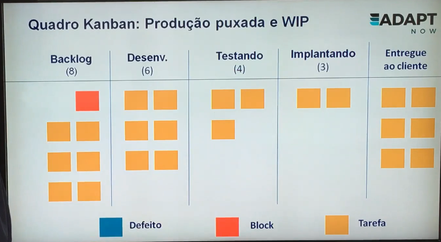

# DevOps
[✏️](https://github.com/meleu/my-notes/edit/master/devops.md)

## Videos

- <https://www.youtube.com/playlist?list=PLEx5khR4g7PLCoWS5k9u2WQ8RdKqhKEKn> - this is a huge (and highly valuable) playlist. Below I'm listing the ones I liked the most.
    - <https://www.youtube.com/watch?v=MCPrtYxuVPU> - 3 Practices for Effective DevOps Adoption - good insights

## Jornada DevOps

<https://www.udemy.com/course/curso-oficial-para-certificacao-exin-devops-profissional>

### Intro

Pilares:

- **Cultura**: colaboração, transparência, confiança...

- **CI/CD**: Integração/Entrega/Implantação Contínua

- **Microsserviços**: APIs, Infrastructure as Code, releases de baixo risco, injeção de falhas (para testar resiliência).

- **Pipeline de Implantação**: automação de testes, TDD.

- **Revisão de Código**: pair programming, gestão de mudança e segurança contínua.

- **Telemetria**: experimentação, feedback contínuo, testes A/B.

- **Lean**: Scrum, definição de pronto, kanban, XP, kata, teoria das restrições.

É mencionado o livro "Toyota kata", como a Toyota consegue disseminar o conhecimento tácito para suas equipes.

### Conceitos Básicos

O que é DevOps?

É um movimento que estimula a colaboração e comunicação entre a área de Desenvolvimento e Operações. Além da colaboração é importante que existam ferramentas de automação para que haja entrega frequente de software com estabilidade e segurança.

Fundamenta-se em Lean, Agilidade e Automação.

### DevOps CALMS

- C - Culture: respeito às pessoas, criar pontes entre Dev e Ops, aceitar mudanças.

- A - Automation: integração e entrega contínua, infra como código, pipeline de implantação, orquestração.

- L - Lean: valor para o cliente (o que não tem valor para o cliente deve ser descartado), lotes pequenos, fluxo contínuo, reduzir WIP e lead time.

- M - Measure: telemetria, controle, melhorias.

- S - Sharing: colaboração, feedback, boa comunicação, transparência.

### Linha do Tempo: do Lean ao DevOps

DevOps é uma evolução natural do Manifesto Ágil (que aplica vários princípios do Lean).

- 1950-60 - Sistema Toyota de Produção e Kanban (Taiichi Ohno).
- 1990 - Lean, no livro "A Máquina que Mudou o Mundo (Womack e Ross).
- 1990-96 - Scrum (Jeff Sutherland e Ken Schwaber) e XP (Ken Beck).
- 1996 - "Pensamento Lean" (Womack e Jones).
- 2001 - Manifesto Ágil
- 2006 - "Entrega Contínua" (Jez Humble e David Farley)
- 2008 - Conferência Ágil: "Princípios ágeis na infraestrutura" (Patrick Debois e Andrew Shafer)
- 2009 - Conferência Velocity: "10 implantações por dia: Cooperação Dev e Ops no Flicker" (Jon Allspaw e Paul Hammond); primeiro DevOps Day na Bélgica (Patrick Debois)
- Surge o termo DevOps CALMS (John Willis e Jez Humble).

### Lean

- Iniciado na Toyota.
- Filosofia que respeita as pessoas.
- Valor para o cliente e elimina desperdício.
- Visita ao Gemba ("o local onde as coisas ocorrem"), Andon, fatos e dados.
- Foco na causa dos problemas.

### Gemba

É uma palavra japonesa que se refere ao local real onde as coisas acontecem/são produzidas.

Todos devem ir ao gemba com frequência para conhecer o "chão de fábrica".

Evita suposições e cria empatia entre as pessoas.

### Corda de Andon

"Se falhar, puxe a Corda de Andon."

É sobre dar confiança e autonomia para os colaboradores. Se eles encontrarem algo de errado, isso deve ser comunicado tão breve quanto possível para evitar de o problema ser propagado.

### Manifesto Ágil

Descobrir maneiras melhores de desenvolver software, fazendo-o nós mesmos e ajudando outros a fazerem o mesmo.

**Os 12 Princípios** - <http://agilemanifesto.org/principles.html>

1. A maior prioridade do time é satisfazer o cliente...
2. Aceitar mudanças de requisitos, mesmo no fim do desenvolvimento...
3. Entregar software funcionando com frequência...
4. Pessoas relacionadas à negócios e desenvolvedores devem trabalhar em conjunto e diariamente...
5. Construir projetos ao redor de indivíduos motivados...
6. O método mais eficiente e eficaz de transmitir informações para, e por dentro de um time, é através de uma conversa cara a cara.
7. Software funcional é a medida primária de progresso.
8. Processos ágeis promovem um ambiente sustentável... (passos constantes)
9. Contínua atenção à excelência técnica e bom design aumenta a agilidade.
10. Simplicidade: a arte de maximizar a quantidade de trabalho que não precisa ser feito.
11. As melhore arquiteturas, requisitos e designs emergem de times auto-organizáveis.
12. Em intervalos regulares o time reflete em como ficar mais efetivo...

### Ciclos de Vida

#### Tradicional ou Preditivo

Negócio -> Desenvolvimento -> Operação -> Cliente

Usado por muito tempo mas hoje em dia, com o ambiente mudando constantemente, não faz mais sentido.

O produto tem que passar pela fase de planejamento com a equipe de Negócio. Em seguida para a equipe de Desenvolvimento implementar. Em seguida a equipe Operação coloca em produção, para só então entregar valor para o cliente.

Demora-se muito tempo para entregar valor ao cliente.

O tempo gasto com planejamento excessivo pode tornar o produto não mais necessário (algum concorrente já saiu na frente ou o cliente já mudou de ideia).

#### Ágil ou Adaptativo

Negócio+Desenvolvimento+Testes -> Operação -> Cliente

Agiliza a comunicação nas primeiras fases do projeto, mas ainda há um gargalo quando a equipe de Operação precisa colocar em produção.

Equipe de Operação ainda fica a parte, e portanto ainda gerando conflitos/demoras.

#### DevOps

Negócio+Desenvolvimento+Testes+Operação -> Cliente

Nesta configuração é mais rápido entregar valor ao cliente, mesmo que em pequenas doses. Isso permite coletar feedback rapidamente e prontamente se adaptar.

### Origem dos Conflitos

"O Financeiro só quer cortar custos."

"O Marketing só pensa em gastar."

"A Auditoria engessa o processo."

"Os meninos da TI não resolvem os problemas."

"O RH deveria olhar pelos funcionários."

"O pessoal do QA deveria pegar esse erro."

### Cultura Colaborativa

empatia + automação = cultura colaborativa

Criatividade para inovar mantendo estabilidade do ambiente.

### Ferramentas DevOps

OBS.: a prova EXIN não cobra ferramentas, pois estas mudam constantemente.

<https://digital.ai/periodic-table-of-devops-tools>

A má implementação ou excesso de customização pode destruir uma ótima ferramenta. Incentive a opinião das equipes no "chão de fábrica".

### State of DevOps Report

"State of DevOps Report" é um documento que vale a pena conferir para entender para onde que o mercado está indo.

- 2020: <https://media.webteam.puppet.com/uploads/2020/11/Puppet-State-of-DevOps-Report-2020.pdf>

Benefícios:
- frequência de deploy.
- lead time (tempo de entrega de ponta a ponta, desde o pedido até a entrega)
- redução de downtime

### Integração Contínua

Controle de versão
  -> Compilação
    -> Testes e análise de código (feedback/correção imediatos em caso de problemas)

Codificação e testes no ambiente dos desenvolvedores.

O instrutor menciona que o SONAR pode ser utilizado para testes

### Entrega Contínua

Integração Contínua finalizada
  -> Deploy em Homologação
    -> Testes e análise de código (feedback imediato em caso de falha)
      -> Pronto para deploy em produção

- Tanto código quanto infraestrutura estejam prontos para implantar com segurança.
- Deploy automatizado nos ambientes que antecedem a produção para inspeção final e novos testes.
- O deploy em produção é manual (só "apertar um botão").

### Implantação Contínua

Integração Contínua finalizada
  -> Deploy em Homologação
    -> Testes e análise de código (feedback imediato em caso de falha)
      -> Deploy automático em produção

A única diferença da Entrega Contínua é que o deploy não depende de intervenção humana. É necessário avaliar se o deploy contínuo faz sentido para o produto sendo desenvolvido.

### Relação entre Integração, Entrega e Implantação

Integração Contínua -> Entrega Contínua -> Implantação Contínua

english:
Continuous Integhration -> Continuous Release -> Continuous Deploy

### Infraestrutura Ágil

É a aplicação dos princípios ágeis na infraestrutura.

Foco na infraestrutura como código:

- Gerência e provisão de ambientes automaticamente.
- Tudo fica centralizado no controle de versões.
- Nuvem/virtualização é a base e existem ferramentas para otimizar (puppet, docker, chef, ansible, etc).

### Kata

Toyota Kata

- Criação de uma estrutura para a prática habitual de melhoria.
- A prática diária e que melhora os resultados.
- Ciclo de estados futuros, resultados-alvos semanais e melhoria contínua do trabalho diário.
- Bastante utilizado na Toyota com foco em pequenas ações e experimentação.

Entender a condição atual <-> Estabelecer a próxima condição-alvo <-> PDCA na direção da condição alvo

(não entendi muito bem, acho que precisarei pesquisar mais sobre o Toyota Kata)

### Trabalho em Andamento (wip)

Muitos WIP acarreta em desperdício de tempo.

[Conforme foi mencionado em uma palestra do Scott Hanselman: perde-se muito tempo com troca de contexto.]

- Muito WIP é um anti-valor, sob forma de potencial retrabalho, já que pode haver alterações enquanto o trabalho está em andamento.

Quadro Kanban: produção puxada e WIP

### Débito Técnico

Se o débito técnico não for resolvido vira uma bola de neve.

Entropia: por mais que um software seja bem feito, com o tempo ele vai se deteriorando.

- Não resolver erros na origem leva a problemas cada vez mais difíceis de corrigir com o passar do tempo.
- Reduz a performance da equipe e aumento o TCO (Custo Total de Propriedade).
- Os objetivos conflitantes das áreas Dev e Ops contribuem para o aumento do débito técnico.

Classificação de débito técnico: Martin Fowler

- Irresponsável e proposital: não há tempo para o design e utiliza uma solução rápida sem qualidade.
- Prudente e proposital: entrega do produto com limitações conhecidas e os riscos são assumidos.
- Irresponsável e sem querer: o time desconhece as técnicas e não sabe a bagunça que está criando.
- Prudente e sem querer: há uma solução que agrega valor ao negócio, mas depois de completar a solução verifica-se que a arquitetura poderia ter sido melhor.

Como resolver débito técnico?

Reservar 20% do tempo da equipe somente para refatoração.

Causas do débito técnico:

- ausência de testes
- requisitos não estão claros
- documentação pobre
- pouco foco em refatoração
- equipes não colaborativas
- conflitos de interesse
- pressão de chefes e áreas de negócio

### Fluxo de Valor

O conceito de valor é subjetivo e nem sempre está associado à dinheiro.

- Fluxo de valor: concretiza uma necessidade em um produto ou serviço para entrega de valor ao cliente.
- Mapeamento: como o processo funciona para entrega de valor ao cliente e identifica gargalos ou desperdícios.

### Lead Time, Tempo de Processamento e % de Conclusão e Precisão

Lead time: tempo do pedido de uma nova funcionalidade pelo cliente até a entrega desta funcionalidade.

solicitação -> início do trabalho -> entrega

O tempo do início do trabalho até a entrega é chamado de "tempo de processamento". Neste caso o tempo que o trabalho ficou na fila não é contabilizado.

Percentual de Conclusão e Precisão (Correto e Completo):

- Significa o percentual que uma tarefa foi concluída com precisão.
- Indica a qualidade de saída em cada etapa do fluxo de valor.

- As 3 métricas mais importantes no Fluxo de Valor são:
  - Lead time
  - Tempo de processamento
  - Percentual de conclusão e precisão

Sucesso no DevOps depende do uso correto da Integração e Entrega Contínua
<http://cio.com.br/gestao/2018/04/09/o-segredo-para-o-sucesso-do-devops/>

Cinco atividades que compõem o DevOps:
1. Integração Contínua
2. Entrega Contínua
3. Infraestrutura de Nuvem
4. Automação de Testes
5. Gerenciamento de Configuração

Integração contínua e entrega contínua são os pilares mais difíceis de dominar.

Principais armadilhas:

1. Automatizar os processos errados.
  - Perguntas a serem feitas:
    - Será que isso precisa ser automatizado agora?
    - Com que frequência o processo ou cenário é repetido?
    - Quanto tempo dura o processo?
    - Quais pessoas e dependências de recursos estão envolvidos no processo? Eles estão causando atrasos na CI/CD?
    - O processo é sujeito a erros se não for automatizado?

2. Confundir implantação contínua com entrega contínua.
  - A equipe de Scrum pode criar um painel antes mesmo dos que os membros saibam o que precisam rastrear. Como resultado a equipe cai vítima de uma falácia lógica: "Estas são as métricas que temos, devem ser importantes".
  - Quando liberar o código-base para a produção é uma decisão de negócios.

3. Não ter dashboards e métricas significativas.
  - Muitas vezes o membro da equipe mais vocal sequestra o processo, e os outros se sentem frustrados com um painel que reúne apenas as preferências de uma pessoa. Ouça a todos.

4. Faltar coordenação entre a CI e CD.
  - A implementação de um pipeline CI decente e um sistema de CD completo leva meses e requer colaboração e garantia de qualidade da equipe de DevOps, engenheiros de operação, Scrum masters, etc. Talvez o aspecto mais difícil da CI/CD é este fator humano. Assim como não é possível programar um relacionamento saudável entre duas pessoas, não é possível automatizar colaboração e comunicação.

5. Balancear a frequência de execução e trabalhos de CI e a utilização de recursos
  - Trabalhos de CI desnecessários consomem recursos, o que desperdiça tempo e dinheiro.
  - O software deve ser dividido em componentes menores para criar pipelines mais rápidos em execução. Ou os trabalhos de CI devem ser concebidos para checkins por lote.

**Manter o objetivo à vista**

CI/CD é essencial pois atende aos objetivos de negócio. DevOps pode criar uma experiência de trabalho melhor para a equipe, mas não é por isso que as empresas implementam DevOps.

### As 3 Maneiras

1. Fluxo
2. Feedback
3. Aprendizado e Experimentação

#### 1. Fluxo

**Objetivo:** acelerar o fluxo dos desenvolvedores para a operação.

**Princípios:**

1. Tornar o trabalho visível (kanban).
2. Reduzir o tamanho dos lotes e intervalos.
3. Aplicar teoria das restrições e otimizar o fluxo (descobrir o gargalo).
4. Remover desperdícios e foco no cliente.
5. Reduzir o número de transferências (handoff).
6. Incorporar qualidade na origem.
7. Limitar o trabalho em andamento, aka WIP. (troca de contexto causa perda de tempo/energia)
8. Infraestrutura como código e self-service.
9. Integração, entrega e implantação contínua.
10. Testes automatizados e TDD.
11. Arquitetura e releases de baixo risco.

#### 2. Feedback

**Objetivo:** obter feedback o mais rápido possível em todos os estágios do fluxo de valor.

**Princípios:**

1. Ver problemas quando e onde ocorrem ("ir ao gemba").
2. Aglomerar (envolver toda a equipe) quando problema aparece ("corda de Andon")
3. Qualidade próxima da fonte (menos aprovações).
4. Telemetria self-service e irradiadores de informação disponível para todos.
5. Desenvolvimento por hipóteses e testes A/B.
6. Equipes de Dev e Ops compartilham o trabalho diário e plantões de suporte 24 x 7 (quando der um incidente chame os dois).
7. Revisão de código: pair programming, sobre os ombros, divulgação 

#### 3. Aprendizado e Experimentação

**Objetivo:** Cultura de alta confiança que permite correr riscos e potencializar o aprendizado contínuo.

Errar rápido, aprender rápido, evitar o mesmo erro novamente.

**Princípios:**

1. Cultura justa e segura para aprender com erros (post-mortem).
2. Injeção de falhas na produção para aumentar resiliência.
3. Converter descobertas locais em melhorias globais.
4. Reservar tempo para melhorar o trabalho diário (kata e blitz de melhoria).
5. Reunião post-mortem sem culpa (relacionado com item 1).
6. Instituir dias de jogos para ensaiar falhas.
7. Difundir conhecimento usando testes automatizados como documentação.

### Sistemas de Registro e Engajamento

(Gartner) TI bimodal é dividida em 2 tipos de sistemas:

1. Registro: ERP, financeiro, RH, sistemas de informação.
2. Engajamento: Sistemas voltados ao cliente ou funcionário (aplicativos, comércio eletrônico).

- Nos sistemas de registro, o mais importante é fazer as mudanças corretamente.
- Nos sistemas de engajamento, o mais importante é fazer as mudanças rapidamente.

Os autores do Manual DevOps consideram que os dois tipos de sistemas deveriam ter estabilidade e velocidade.

### Aspectos Organizacionais

#### Lei de Conway

"O design do sistema sempre é uma cópia da estrutura de comunicação da organização."

Na cultura DevOps, o objetivo é combater o que é dito nessa lei.

tipo de estrutura | características | resultados
-|-|-
organizções hierarquizadas, comando e controle | pouca colaboração e comunicação ineficaz | Sistemas centralizados, processos engessados e lentidão de resposta ao mercado e clientes
Organizações flexíveis e equipes com grande autonomia | Forte colaboração e objetivos compartilhados | Sistemas modulares, fluxo de valor efetivo e adaptabilidade para atender mercado e clientes

[Achei as observações acima muito simplórias e tendenciosas de forma a parecer que "hierarquia causa burocracia, falta de colaboração e lentidão". No entanto, na _minha visão_ de DevOps, nas ditas "organizações flexíveis", toda essa autonomia e flexibilização só existe porque grande parte da burocracia é automatizada.]

**Minimizando os efeitos da lei de Conway**

- Manter um time pequeno [squad?]
  - diminui a quantidade de canais de comunicação
  - `canais = (n^2 - n) / 2`
- Incentivar que todos os participantes sintam-se proprietários pelo resultado final entregeue ao cliente.
  - Você implementa, você executa.
- Apelido criado pela Amazon: "equipe duas pizzas".
  - Uma equipe em que apenas 2 pizzas seja suficiente para alimentar a todos.

#### Benefícios das equipes pequenas

1. Entendimento claro do sistema que está trabalhando, e evita problema de comunicação.
2. Limita a velocidade de crescimento desordenado do sistema e ajuda a garantir que a equipe mantenha um entendimento compartilhado.
3. Concede autonomia para as equipes definirem a forma de trabalho para entregar o resultado combinado.
4. Possibilita experiência de liderança em um ambiente onde a falha não tem consequências desastrosas.

#### Estrutura flexível potencializa DevOps

Gestão Clássica | Gestão de Fluxo de Valor
-|-
informação restrita a poucos (silos) | informações compartilhadas (interfaces)
foco maior nos departamentos | foco nos objetivos dos processos
pouco foco no cliente | foco nos clientes dos processos
comunicação é vertical | comunicação é transversal
delegação de autoridade limitada | alto grau de empoderamento
visão restrita à tarefa departamental | visão macro e organizacional
processos podem não agregar valor | melhoria contínua nos processos
estruturado nas habilitações e poderes | estruturado no modo de fazer o trabalho

#### Papéis DevOps

- Dono do Produto: a voz interna da empresa que define as funcionalidades
- Desenvolvimento: criar as funcionalidades dos aplicativos
- QA: realiza loops de feedback para garantir qualidade
- Operações: manter o ambiente de produção e alcance do SLA (?)
- Segurança: manter segurança de sistemas de dados
- Gerente de Release: administrar e coordenar a implantação em produção
- Gerente de fluxo: garantir que alcance os requisitos do cliente

#### Etapas DevOps

1. equipe dedicada: coloque em um espaço físico separado os melhores generalistas
que tenham uma relação respeitosa e de longa data
2. metas SMART
3. sprints curtos
4. requisitos não funcionais: reservar pelo menos 20% do ciclo de melhoria para reduzir dívida técnicoa.
5. visibilidade: divulgar evolução das melhorias
6. ferramentas: backlog unificado

#### Perfis I, T e E

**I**:
- especialista em uma única área
- cria gargalo
- impedem flexibilidade
- ruim para um time DevOps

**T**:
- especialista com um "quê" de generalista
- habilidades em outras áreas
- flexível

**E**:
- Experiência, Expertise, Execução, Exploração

#### Integração Ops e Devs

1. Criar serviços compartilhados para aumentar a produtividade do desenvolvedor:
    - self-service, sem ticket de solicitação
2. Incorporar engenheiros de Ops nas equipes de serviço
3. Ops ter ligação com cada equipe de serviço para entender:
    - qual funcionalidade do novo produto
    - como opera e escalabilidade
    - monitoramento e métricas
    - desvios arquiteturais e padrões
4. Integrar Ops nos rituais de Dev

### 1a. maneira: Fluxo

**Conteúdo**:

1. pipeline de implementação
2. testes automatizados
3. integração contínua
4. release de baixo risco

#### Pipeline de Implementação

Fonte: livro "Continuous Delivery"

- É o processo de automação do fluxo de valor que leva o software do
controle de versão até o ambiente de produção (cliente).
- Principal objetivo: feedback rápido para todos.
- Correção "imediata".

Exemplo de Ferramenta: Jenkins

**Mudanças se movendo no pipeline**:

Equipe de entrega -> controle de versão -> testes unitários -> teste de aceitação -> testes de aceitação do usuário -> entrega/release

**Visão do Pipeline:**

- Estágio de Commit:
    - Garante que o sistema funciona em nível técnico.
    - Compila, testes automatizados, análise de código.
    - Se OK, gera artefatos no controle de versão.
- Testes de aceite automatizado:
    - Garante o sistema OK (funcional e não-funcional): comportamento atende às necessidades do cliente.
    - Configuração do ambiente, instalação de binários, smoke tests, testes de aceitação.
- Testes do aceite do usuário:
    - Detecta defeitos não encontrados.
    - UAT (User Acceptance Testing).
    - Recomendado fazer testes em paralelo.

**Benefícios do Pipeline:**

- testes contínuos e feedback rápido.
- implantações em produção tornam-se parte rotineira do trabalho diário.
- autonomia para a equipe desenvolver, testar e implementar com segurança.

**Requisitos para o Pipeline:**

- implementar da mesma forma em todos os ambientes.
- testes de fumaça: confirmar se conexão com sistemas de apoio está OK (banco de dados, APIs externas).
- garantir ambientes consistentes e sincronizados.

**Capacidades do Pipeline:**

- implantação em produção do pacote criado com um click self-service.
- requisitos de auditoria e conformidade, registrar automaticamente quais comandos foram executados.
- teste de fumaça

#### Infraestrutura como Código

- Código e configurações dentro do controle de versão.
- Criação automatizada e sob demanda (self-service) em todos os ambientes.
- Todos os estágios do fluxo de valor com ambientes iguais/semelhantes ao de produção.
- Infraestrutura imutável: foco em recriar todo o ambiente de produção de forma rápida em vez de realizar alterações.

**Ferramentas:**

- virtualização: VMWare, Vagrant, Amazon Machine EC2
- criação de servidor "bare metal": instalação PXE via rede
- gerenciamento de configuração: Puppet, Chef, Ansible, Salt, CFEngine.
- configuração de SO automatizada: Solaris Jumpstart, Red Hat Kickstart, Debian Preseed.
- Containers: Docker, Vagrant
- Nuvem: AWS, GCP, Azure, DigitalOcean

#### Definição de Pronto

- Ágil tradicional: "ao final de cada intervalo de desenvolvimento temos código integrado, testado, funcionando e que pode ser entregue"
- DevOps adiciona:
    - "demonstrado em um ambiente do tipo produção"
    - "criado a partir do trunk com um processo de um click e validado com testes automatizados"

#### Controle de Versão

- Importante incluir informações do ambiente que o software é executado e deve ser compartilhado por todos do fluxo de valor: QA, Dev, Ops, Segurança.
- Todo o código do aplicativo e dependências devem estar presentes.
- Qualquer script usado para criar esquemas de BD, dados de referência de aplicativo, etc.
- Todas as ferramentas de criação de ambiente e artefatos usados na infra como código.
- Qualquer arquivo usado para criar containers.
- Todos os testes automatizados de apoio e quaisquer scripts de teste manual.
- Script de empacotamento de código, implementação, migração de BD e provisionamento de ambiente.

#### Remover Restrições

Teoria das Restrições: toda atividade tem uma restrição que mais salta aos olhos. É nesta restrição que devemos focar.

**5 Passos para Remover Restrições:**

1. Identificar o gargalo
2. Explorar as restrições
3. Sincronizar o sistema à restrição
4. Elevar a restrição
5. Melhoria contínua

Exemplos

Restrição | Ação
-|-
Demorar para criar e configurar ambientes | Infraestrutura como código
Demora no deploy | Automatizar deploys
Demora para testar funcionalidades | Automatizar os testes
Arquitetura monolítica | Usar arquitetura modular ou microsserviços

Dica: Microsserviços potencializa DevOps

#### Desperdícios

Desperdícios que podem ser removidos:

Desperdício | Descrição
-|-
Trabalho parcialmente pronto | Trabalho não concluído ou parado nas filas
Processos extras | Atividades desnecessárias para agregar valor ao cliente
Recursos extras | Funcionalidades que não agregam valor para o cliente
Multitarefa | Pessoas envolvidas em vários projetos e fluxos ao mesmo tempo
Movimentação | Movimento desnecessário
Defeitos | Retrabalho para corrigir erros
Trabalho manual | Atividade manual propensa a erros
Ato heróico | Esforço acima do normal para atingir meta

#### Testes Automatizados

"Sem testes automatizados, quanto mais código escrevemos, mais tempo e dinheiro são necessários para testá-lo"
~ Gary Gruver

- Testes apenas no final do desenvolvimento tiram oportunidade de aprendizado e impactam a entrega de valor.
- Fundamental adicionar ao pipeline de implementação.
- Para agilizar, é possível executar testes em paralelo

**Tipos de Teste**:

- Teste Unitário
    - testa um única método, classe ou função.
- Teste de Aceitação
    - testa como um todo e maior nível de funcionalidade
    - testa se foram introduzidos erros de regressão
    - objetivo: provar que o software funciona de acordo com a visão do cliente
- Teste de Integração
    - garantir que o código interage corretamente com outros aplicativos e serviços em produção

**Importante para a prova**

- priorizar os testes unitários
- feedback imediato -> correção na origem

Pirâmide de teste ideal:

Pirâmide de teste não-ideal:

**TDD: Test-Driven Development**

1. Vermelho: escreve o teste (que irá falhar)
2. Verde: Implementa o suficiente para passar
3. Amarelo: Refatora com otimizações

#### Ambiente de Desenvolvimento

- Trunk: código principal "oficial".
- Branches: ramificações onde os desenvolvedores estão trabalhando

- As mudanças em cada branch devem ser integradas ao trunk.
- Quanto mais tempo demora o merge, maior o conflito e complexidade.
- O uso de muitas branches costuma aumentar o débito técnico.

**Estratégias de branching**

Estratégia | Vantagens | Desvantagens
-|-
Produtividade individual | Projeto privado que não atrapalha outras equipes | Merge no final do projeto gera muitos problemas
Produtividade da equipe | Fila única com todos trabalhando no trunk e commit frequente. Não há o estresse de merge no final do projeto | Difícil de implantar e cada commit pode quebrar o projeto inteiro. Deve-se puxar a corda de Andon para que todos ajudem na correção.

#### Dívidas Técnicas

- Erros não corrigidos aumentam dívida técnica.
- Código sem padrão.
- Código sujo.
- Teste ineficaz.
- Bugs escondidos.
- Dificulta entrega de qualidade ao cliente do fluxo de valor.

Dicas:

- Desenvolvimento baseado no trunk.
- Infraestrutura como código.
- Testes automatizados.
- Integração contínua e lotes pequenos.
- Blitz de melhoria.
- Feedback imediato e aprendizado contínuo.

#### Release de Baixo Risco

Momentos diferentes:

Implantação -> Liberação

inglês: Deploy -> Release

**Categorias de Liberação**

- Baseada no ambiente:
    - há 2 ou mais ambientes e apenas um fica ativo para os clientes.
- Baseada no aplicativo (recomendado)
    - Novas funcionalidades de forma seletiva usando configurações simples.
    - Usar feature flags.

##### Baseadas no Ambiente

**Release Azul-Verde**

- Dois ambientes, um ativo e o outro em stand-by.
- Novas alterações podem ser implantadas no ambiente stand-by e em seguida o tráfego é direcionado para ele.
- É o tipo mais simples de release de baixo risco.
- É um problema se forem necessárias duas versões de BD.

**Release Canário**

- Dois ambientes, um ativo e o outro stand-by.
- Um deles receberá as novas features e parte do tráfego de usuários (10%) e aumenta gradativamente.
- O **sistema imune a cluster** é uma variação do Canário e permite reverter o deploy automaticamente quando ocorre falha em produção (ex.: monitoramento indicando maior tempo de resposta).

##### Baseadas no Aplicativo

**Alternância de Recursos**

- Liga/desliga recursos da aplicação de acordo com critérios definidos (ex.: funcionários, localidade).
- Feature flag
- Lançamento escuro: implantação sem o usuário perceber.

Benefícios do release baseado no aplicativo:

1. Permite reverter facilmente quando ocorrem problemas.
2. Degradar o desempenho: reduzir qualidade do serviço quando existe risco de falha em produção (Netflix: retira algumas funcionalidades quando há risco de queda de alguns microsserviços).
3. Aumentar resiliência com arquitetura voltada a serviços: permite ocultar recursos ainda não prontos ou com defeito.

#### Arquitetura de Baixo Risco

Uma arquitetura de baixo risco é baseada em microsserviços, no entanto envolve um custo em conhecimento na equipe.

Microsserviços x Monolito

Microsserviços: Funcionalidades em serviços independentes

Aplicação Monolítica: Funcionalidades ficam em processo único.

Arquitetura | Vantagens | Desavantagens
-|-|-
Monolítica | Inicialmente simples, baixa latência entre processos (não depende de rede), eficiente em pequena escala | Fraca escalabilidade e redundância, longo período de build, implantação "big-bang".
Microsserviço | Cada unidade é simples, escalonamento independente, teste/implantação independente, facilita visão por produto (cada squad é responsável por um pedaço da aplicação) | Latência de rede, precisa de ferramentas para gerenciar dependências.

