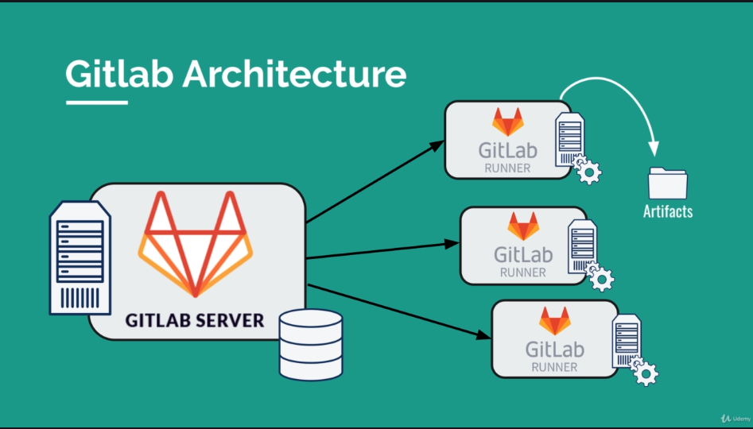

# gitlab CI/CD
[✏️](https://github.com/meleu/my-notes/edit/master/gitlab.md)

## Udemy Course

- link: <https://www.udemy.com/course/gitlab-ci-pipelines-ci-cd-and-devops-for-beginners>

### Introduction

Create a repo and then add a `.gitlab-ci.yml` file like this:
```yml
# define the order of execution
stages:
    - prep
    - build
    - test

# list of jobs
prepare the car:
    # defining which stage this job belongs to
    stage: prep
    script:
        - mkdir build
        - touch build/car.txt
    # artifacts are kept for the next job
    artifacts:
        paths:
            - build/

author:
    stage: build
    script:
        - mkdir meta
        - echo "$GITLAB_USER_NAME" > meta/author
    artifacts:
        paths:
            - meta/

build the car:
    # multiple jobs with the same stage run in parallel
    stage: build
    script:
        - cd build
        - echo "chassis" > car.txt
        - echo "engine" >> car.txt
        - echo "wheels" >> car.txt
    artifacts:
        paths:
            - build/

test the car:
    stage: test
    script:
        - ls
        - test -f build/car.txt
        - cd build
        - cat car.txt
        - grep "chassis" car.txt
        - grep "engine" car.txt
        - grep "wheels" car.txt
        - cat ../meta/author

```

**Notes**:
- the filename **must** be `.gitlab-ci.yml`.
- the file **must** be in the root dir of the project.
- the Auto DevOps is NOT enabled (not sure what it means).


#### gitlab architecture



Configuring Runners:
- settings > CI/CD > Runners > Expand


### Exercise with Gatsby

```
npm install -g gatsby-cli
gatsby new static-website
cd static-website
gatsby develop
# create a repository in gitlab called my-static-website
git remote add origin git@gitlab.com:USERNAME/my-static-website.git
git push -u origin master
# check the gitlab repo

# building locally
gatsby build
# the output of this process is placed in the public dir
ls public
```

Create a `.gitlab-ci.yml`:
```yml
build website:
  image: node
  script:
    - npm install
    - npm install -g gatsby-cli
    - gatsby build
  artifacts:
    paths:
      - ./public
```

