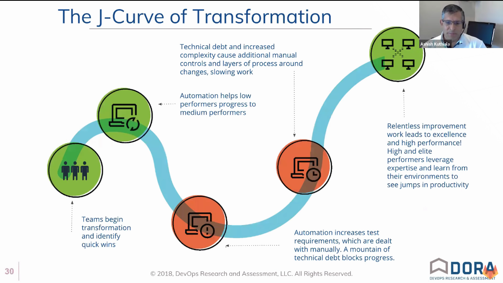

# Keys to DevOps Success with Gene Kim

- <https://youtu.be/dbkj0qXQ22A>

It's actually a video with Gene Kim sharing his thoughts about the 2018 State of DevOps.

## 2018 State of DevOps - Key Themes

Software Delivery and Operational performance (SDO performance).

SDO is the practice behind not just creating, but also operating, software in ways that generate powerful business outcomes.

## Technical Practices

Trends in 2018:

- Monitoring and observability
- Continuous testing
- Database change management
- "Shifting left" on security

## Cultural Practices

Trends in 2018:

- Influencing culture through autonomy & trust
- Creating a culture of learning (retrospectives)

## Doing Cloud Right

Using cloud in essential ways that matters.

- On-demand self-service
- Broad network access
- Resource Pooling
- Rapid elasticity
- Measured service

## Open Source Software

The data shows that using open source software is correlated with **high SDO performance**.

Teams that use open source software are **1.75X more likely** to be **elite performers**.

Those same teams are also **1.5X more likely** to expand their **open source usage** in future.

## Industry Doesn't Matter

**Industry does not matter** for achieving high performance for software delivery.

High performers exist in both **non-regulated** and **highly regulated industries** alike.

**Any team in any industry** has the potential to achieve a hight degree of SDO performance.

## Don't Forget the Datab ase

Integrating database work into software delivery **positively contributes to SDO peformance**.

## An Evolution in Testing

Continuous tsting **extends automated testing** practices and **positively contributes to SDO performance**.

## Looking Into Our Systems

Teams with a comprehensive and observability solution were **1.3 times more likely to be an elite performer.**

Having a monitoring and observability solution **positively contributed to SDO performance**.

Fun stats fact: monitoring and observability load together.

> doubt: "Westrum organizational culture", what does that mean?

## Influencing culture - learning

**Retrospectives that drive learning & improvement** contribute to a climate for learning and a better culture.

**A strong climate for learning is key** in times of changing tech, market conditions, and customer demands.

## Influencing culture - autonomy

Giving teams **autonomy improves voice and trust**

**Voice and trust improve Westrum organizational culture**, which drives SDO and organizational performance.

## Misguided Performers

**Some teams optimize for caution**: low deploy frequency, high lead times, and low deployment failure.

That same group also reports the **longest times to restore service** for outages (1-6 months!).

Large-batch changes add complexity & no one thinks it will happen to them, but 5% of teams **suffer the consequences**.

> MTTR: Mean Time To Repair

## GitLab MVC

MVP -> MVF -> MVC

Minimum Viable Product -> MV Feature -> MV Change

## The J-Curve of Transformation

## Outsourcing

Low performing teams are **3.9X more likely** to use functional outsourcing than elite teams.

Elite teams **rarely adopt** functional outsourcing.

Misguided performers have the **highest use of outsourcing** of all groups.

## Major Takeaways

### Ways to Improve SDO Performance

- Adopting essential cloud characteristics is key to truly realizing benefits
- Organizations need to make smart investments in technology, lean practices and culture -- holistic transformation is important
- The data on functional outsourcing is in, and it's decisive: this is not a winning bet
- Optimize for throughput, stability and availability.

## Books Suggested

- DevOps Handbook
- Accelerated

